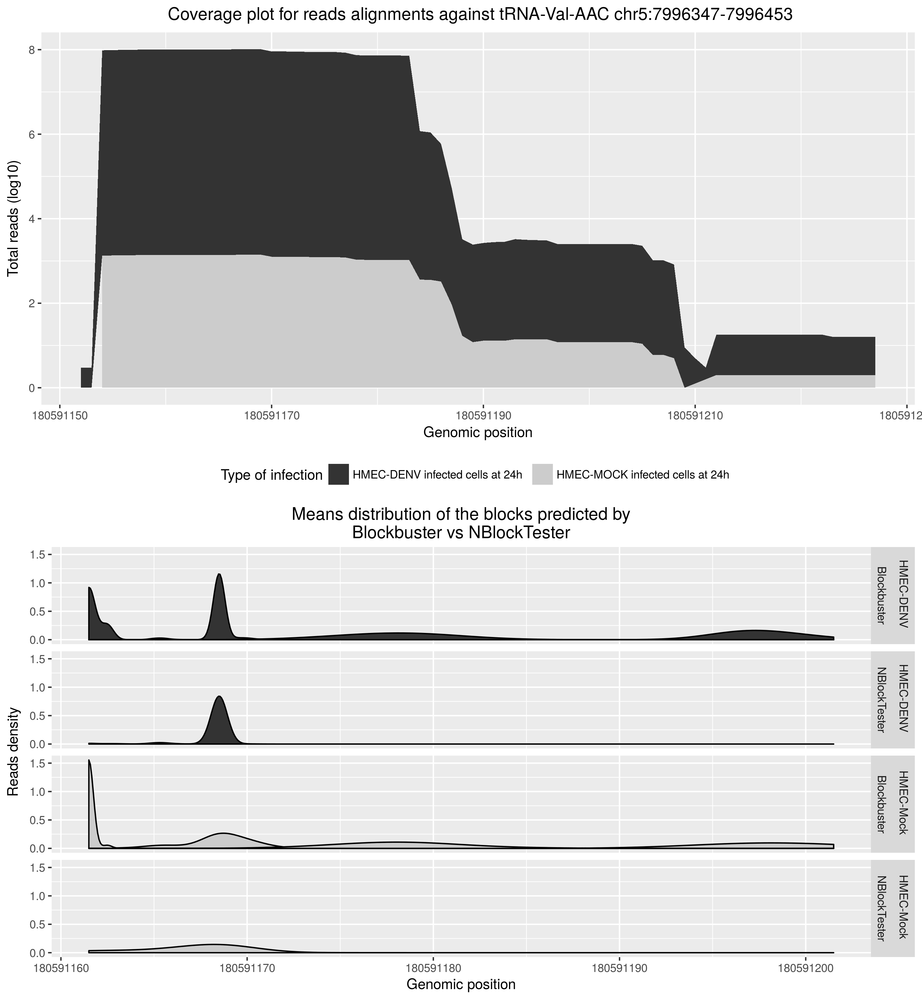
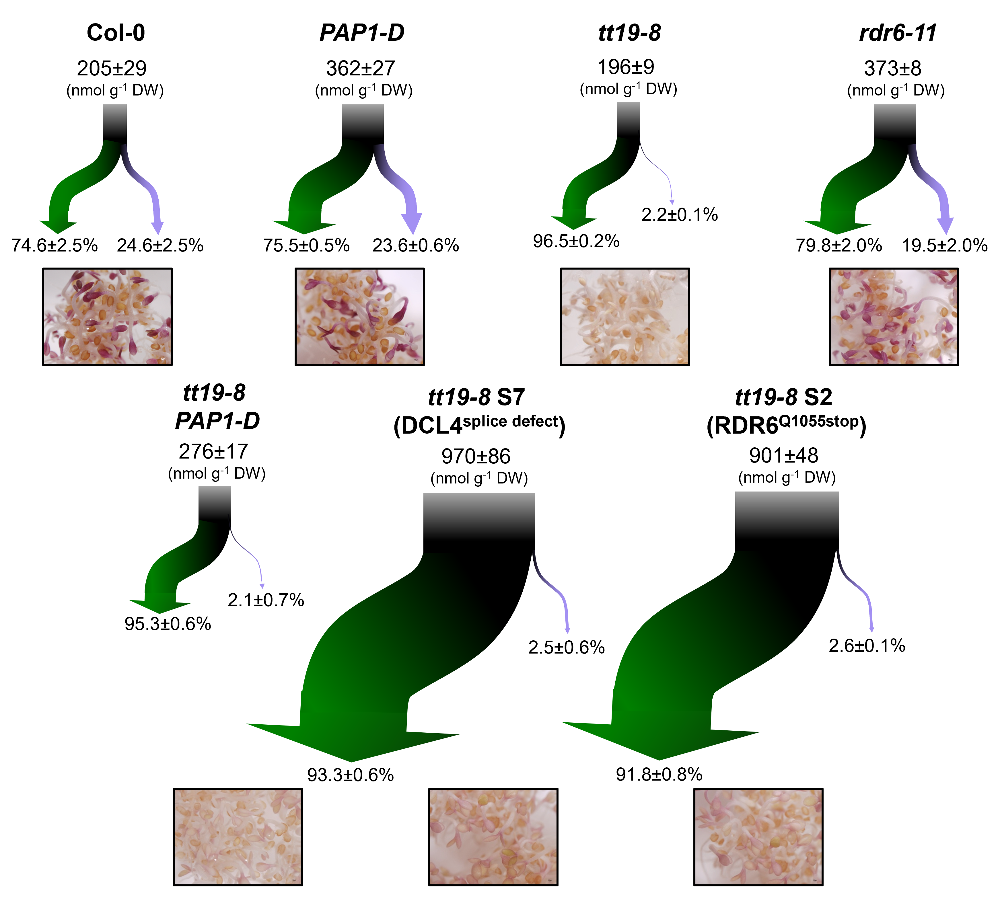
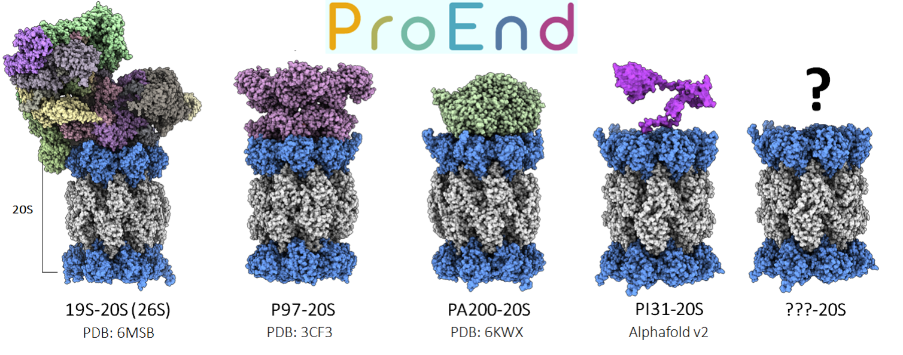
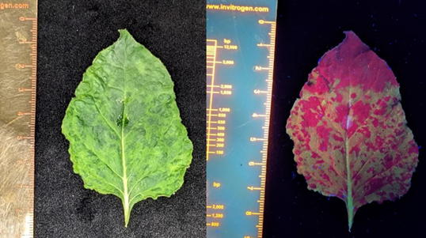

I am a Biologist and M.Sc. Bioinformatics from the [Universidad Nacional de Colombia](https://unal.edu.co/). Currently I am a PhD student at the Department of Plant Biology at [SLU](https://www.slu.se/), working in [Dr. Hafrén's lab](https://andershafren.wixsite.com/website) on in Plant-Virus Molecular interactions. My Ph.D. research focuses on how plant viruses manipulate Arabidopsis's post-transcriptional regulatory mechanisms, including RNA interference machinery, Stress granules, and Translational regulation.

## Research experience

Since the earliest steps of my education, I have been fascinated by basic research on virology and evolutionary biology, later in my career, I found out that the development and application of computational methodologies is of great help to answer questions on the intersection of these fields. 

As a summary of my academic experience, during my master thesis in Dr. Clara Bermudez's laboratory, I conducted computational analyses on small-RNAs dataset derived from multiple time-points of Dengue viral infected humans cell lines. In this project, I characterized Dengue-induce expression induction of miRNAs @alvarez2019dengue and tRNA-derived fragments -a set of ncRNA molecules that required the development of new computational tools for their proper characterization. Specifically, I developed a bioinformatics tool called  [NBlockTester](https://github.com/AimerGDiaz/NBlockTester) @gutierrez2024systematic to distinguish the expression of small RNAs from background noise in the ncRNA source.

::: {style="text-align: center;"}
<figure>

```{=html}

```
<figcaption style="margin-top: 10px;">

<strong>NBlockTester: tRNA-derived fragments detection</strong>

</figcaption>

</figure>

<a name="NBlockTester"></a>
:::


More recently,  before beginning my Ph.D. in Sweden, I had the opportunity to work as visiting research in two laboratories. First in the Dr. Erich Grotewold lab, I worked with transcriptomic and small RNA-seq data to characterize a synergistic effect driven by the interfering role of trans-acting small RNAs in the regulation of specialized metabolism genes in *Arabidopsis thaliana* @jiang2020synergy. My second visiting research experience was in Dr. Adami’s lab, where I investigated the evolutionary persistence of a unique type of small ncRNAs found in *Trypanosome brucei* mitochondria, called guide RNAs. These molecules not only play a role in RNA editing of mRNAs but may also function as a mutational robustness system that protects the mitochondrial genome during severe and periodic bottlenecks.

::: {style="text-align: center;"}
<figure>

```{=html}

```
<figcaption style="margin-top: 10px;">

<strong>Flavonoid flux maps displaying synergy effect between anthocyanin and RDR6/SGS3/DCL4 siRNA pathway</strong>

</figcaption>

</figure>

<a name="synergy"></a>
:::

Lastly, In collaboration with [David Salcedo](https://drtakuomics.github.io/) at David Smith's lab, I co-developed the ProEnd database, which analyzes HbYX motif-containing proteins across all life proteomes, of course including viruses @salcedo2024proend. Our work has focused on exploring the evolutionary and functional diversity of these motifs, particularly in relation to proteasome regulation. Through this collaboration, we have integrated bioinformatics approaches with experimental validation, identifying novel candidates that may expand the known roles of HbYX-like sequences.

::: {style="text-align: center;"}
<figure>

```{=html}

```
<figcaption style="margin-top: 10px;">

<strong>Proend: 20S structural interacting HbYX motif detection</strong>

</figcaption>

</figure>

<a name=""></a>
:::


## Teaching activities

I've developed the [Sociovirology Lab](https://github.com/AimerGDiaz/Sociovirology_Lab), a laboratory practice in which masters students investigate how variations in viral genetics lead to differential impacts on plant growth and defense trade-off. This is achieved using the compatible *Nicotiana benthamiana* / *Potyvirus rapae* (Turnip Mosaic Virus) pathosystem.

::: {style="text-align: center;"}
<figure>

```{=html}

```
<figcaption style="margin-top: 10px;">

<strong>TuMV GFP expression in *Nicotiana benthamiana*</strong>

</figcaption>

</figure>

<a name="TuMV_GFP"></a>
:::

## Public repositories

-   [ProEnd](https://github.com/AimerGDiaz/proend-scripts)

-   [NBlockTester](https://github.com/AimerGDiaz/NBlockTester)

-   [Selection of codes in bash, awk, perl, python and R](https://github.com/AimerGDiaz/Codes_Repository)


# PhD projects

Private repositories

-   [Vertical Virus Transmission in RNA Interference Deficient Plants](https://github.com/AimerGDiaz/TRoV_NextGeneration)

-   [Rider of the Plant’s defense storm: Turnip Mosaic Virus modulates Plant’s stress granule response](https://github.com/AimerGDiaz/TuMV_SG_repurposing)   

-   [CaMV and the Nightless Day: The Virus That Keeps Arabidopsis in a State of Restless Translation](https://github.com/AimerGDiaz/UPSC_Riboseq)

-   [Mutually Exclusive Binding of P6 Complexes to dsRNA or TOR Determines Its Role in Transactivation vs RNA-granules Condensation](https://github.com/AimerGDiaz/ProteinStructure)

# Additional repositories

-   [IP-Proteomis: Dfifrential Viral manipulation of UPBs](https://github.com/AimerGDiaz/Ub_IP_TuMV-CMV-CaMV)

-   [CaMV manipulation of autophagy pathway](https://github.com/AimerGDiaz/IP_ATG8a-NBR1)

-   [Viral Meta-Transcriptomics](https://github.com/AimerGDiaz/PlantVirology)

-   [PTM Proteomics](https://github.com/AimerGDiaz/Proteomics_PTM)

-   [RNA editing in *Trypanosomes* as mutational Robustness mechanism](https://github.com/AimerGDiaz/Trypanosomes_RNA_editing)

-   [*Trypanosomes* Guide RNAs Networks](https://github.com/AimerGDiaz/gRNA-Annotation)
<!--https://medium.com/@evanca/set-up-your-portfolio-website-in-less-than-10-minutes-with-github-pages-d0efa8ff56fd-->


# Science communication 

-   [Bio-Viroloía](https://github.com/AimerGDiaz/Bio-Virologia) blog and [bookdown](https://aimergdiaz.github.io/Bio-Virologia/)

::: {style="text-align: center;"}
<figure>

```{=html}

```
<figcaption style="margin-top: 10px;">

<strong>Bio-Viroloía logo</strong>

</figcaption>

</figure>

<a name="TuMV_GFP"></a>
:::

# Scientific publications 
